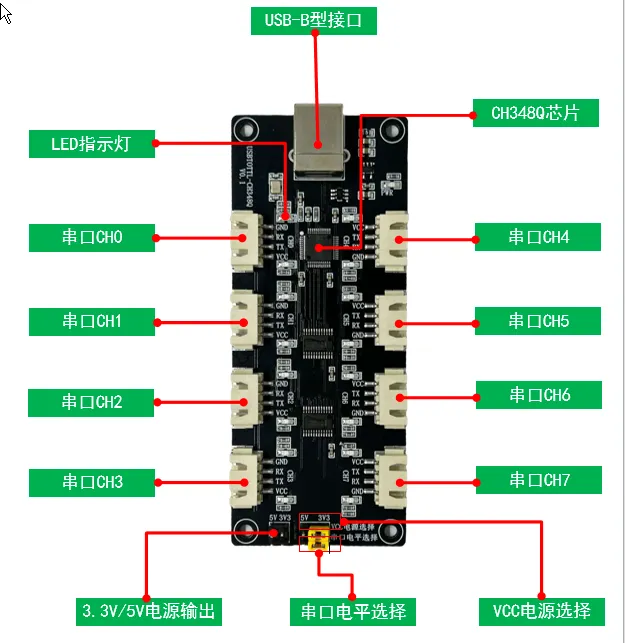
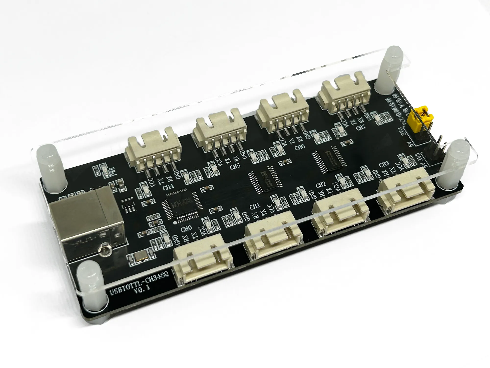
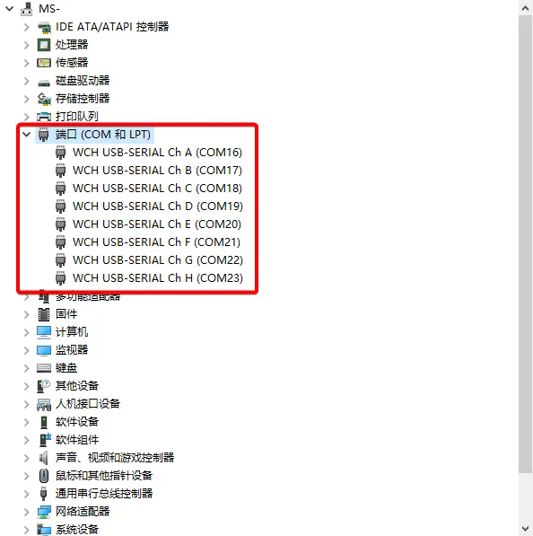

MD0778-CH348 8路双电平串口模块
==============================

产品介绍

CH348Q为一款八路USB转TTL工具板，通过USB方口与PC端进行连接，默认配盖亚克力，对外接口为XH2.54-4P端子

因对外端子接口不是每个客户需要的，默认不赠送XH2.54-4P的线材，需客户根据自身需求，进行选购！

|image1|

|image2|

驱动程序(Windows)
=================

如果插入Windows电脑后，不安装驱动，使用系统自带的驱动，可能会出问题，例如\ **长数据丢包**\ 等问题。\ **因此不建议使用系统自带的驱动，建议安装如下驱动：**

直接下载：:download:`CH348Q驱动. <./CH348Q驱动.zip>`

Q&A

Q：USB插入电脑后，window电脑无法正常识别

A：请检查是否安装USB驱动程序，可以在PC端的设备管理器中查看，正常情况如下

|image3|

